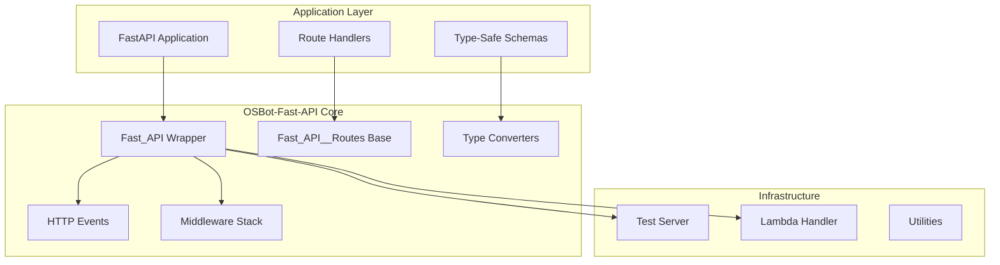

# 📚 OSBot-Fast-API Documentation

## 🎯 Overview

**Package**: `osbot_fast_api`  
**Current Version**: v0.9.1  
**Purpose**: A Type-Safe wrapper around FastAPI that provides strong typing, middleware support, and AWS Lambda integration through Mangum  
**Status**: Production Ready

## 📖 Documentation Structure

This documentation follows a structured approach to thoroughly document the OSBot-Fast-API package:

### Core Documentation
- [Architecture Overview](./architecture/osbot-fast-api-architecture.md) - System design and component relationships
- [Type-Safe Integration](./type-safe/type-safe-integration.md) - Type conversion system and patterns
- [HTTP Events System](./features/http-events-system.md) - Request/response tracking and monitoring
- [Middleware Stack](./features/middleware-stack.md) - Built-in and custom middleware

### API Documentation
- [Fast_API Class](./code/osbot_fast_api/api/Fast_API.py.md) - Main FastAPI wrapper
- [Fast_API__Routes](./code/osbot_fast_api/api/Fast_API__Routes.py.md) - Route organization
- [Type Converters](./code/osbot_fast_api/utils/type_safe/) - Type-Safe to BaseModel converters

### Usage Guides
- [Quick Start Guide](./guides/quick-start.md) - Getting started with OSBot-Fast-API
- [LLM Prompts](./guides/llm-prompts.md) - Prompts for working with this package
- [Testing Guide](./guides/testing.md) - Testing strategies and utilities

## 🏗️ High-Level Architecture



## 🚀 Key Features

### Type-Safe First
- Automatic conversion between Type_Safe classes and Pydantic BaseModels
- Strong typing throughout the application
- Validation at API boundaries

### Production Ready
- Built-in HTTP event tracking
- Comprehensive middleware support
- Global exception handling
- AWS Lambda compatibility

### Developer Experience
- Minimal boilerplate code
- Convention over configuration
- Integrated testing utilities
- Clear extension points

## 📦 Package Components

| Component | Purpose | Location |
|-----------|---------|----------|
| `Fast_API` | Main FastAPI wrapper with Type-Safe support | `/api/Fast_API.py` |
| `Fast_API__Routes` | Base class for route organization | `/api/Fast_API__Routes.py` |
| `Fast_API__Http_Events` | HTTP request/response tracking | `/api/Fast_API__Http_Events.py` |
| `Type_Safe__To__BaseModel` | Type conversion system | `/utils/type_safe/` |
| `Fast_API_Server` | Test server for integration testing | `/utils/Fast_API_Server.py` |

## 🔧 Quick Example

```python
from osbot_fast_api.api.Fast_API import Fast_API
from osbot_fast_api.api.Fast_API__Routes import Fast_API__Routes
from osbot_utils.type_safe.Type_Safe import Type_Safe


# Define a Type-Safe schema
class User(Type_Safe):
    name: str
    email: str
    age: int


# Create routes
class Routes_Users(Fast_API__Routes):
    tag = 'users'

    def create_user(self, user: User):
        return {'created': user.name}

    def setup_routes(self):
        self.add_route_post(self.create_user)


# Setup application
fast_api = Fast_API()
fast_api.setup()
fast_api.add_routes(Routes_Users)
app = fast_api.app()
```

## 📊 Performance Characteristics

| Operation | Complexity | Cached |
|-----------|------------|---------|
| Type Conversion | O(n) fields | ✅ |
| Route Registration | O(1) | ❌ |
| HTTP Event Tracking | O(1) | ❌ |
| Middleware Execution | O(m) middleware | ❌ |

## 🔍 Documentation Navigation

### By Feature
- [Type Safety System](./type-safe/)
- [HTTP Events](./features/http-events-system.md)
- [Middleware](./features/middleware-stack.md)
- [Testing](./guides/testing.md)

### By Component
- [Core API Classes](./code/osbot_fast_api/api/)
- [Utilities](./code/osbot_fast_api/utils/)
- [Examples](./code/osbot_fast_api/examples/)

### By Use Case
- [Building APIs](./guides/quick-start.md)
- [AWS Lambda Deployment](./guides/lambda-deployment.md)
- [Testing Strategies](./guides/testing.md)

## 📝 Version History

- **v0.9.1** - Current stable release
- Production ready with full Type-Safe integration
- Comprehensive middleware support
- AWS Lambda compatibility