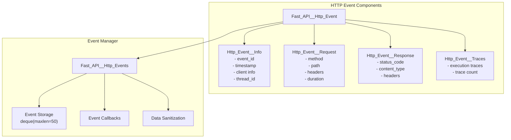
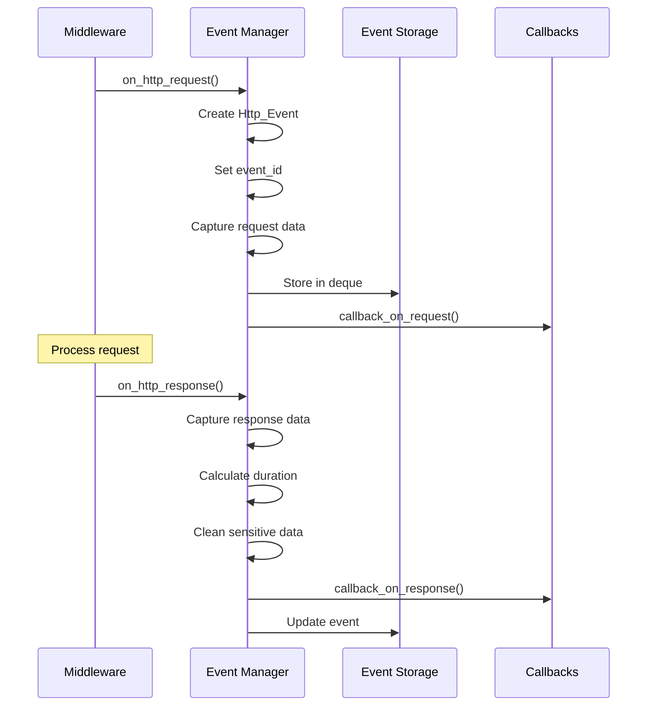
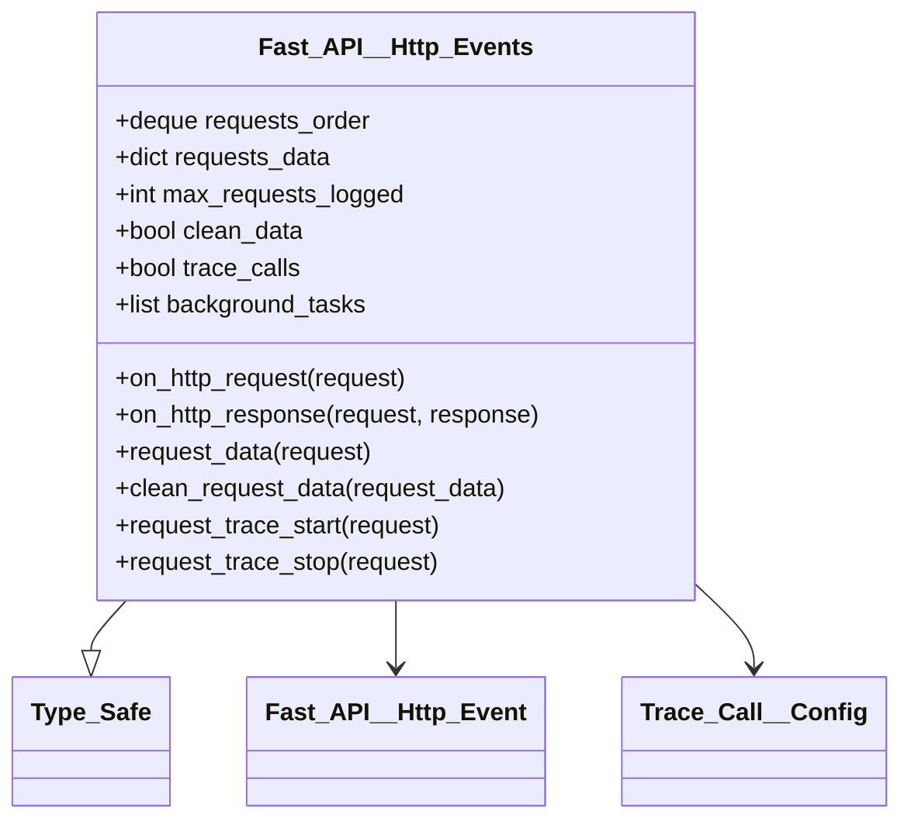
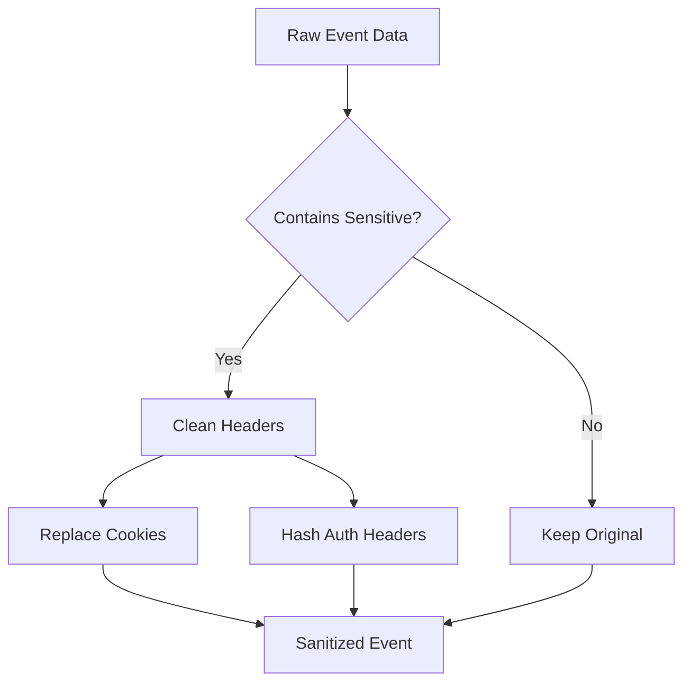
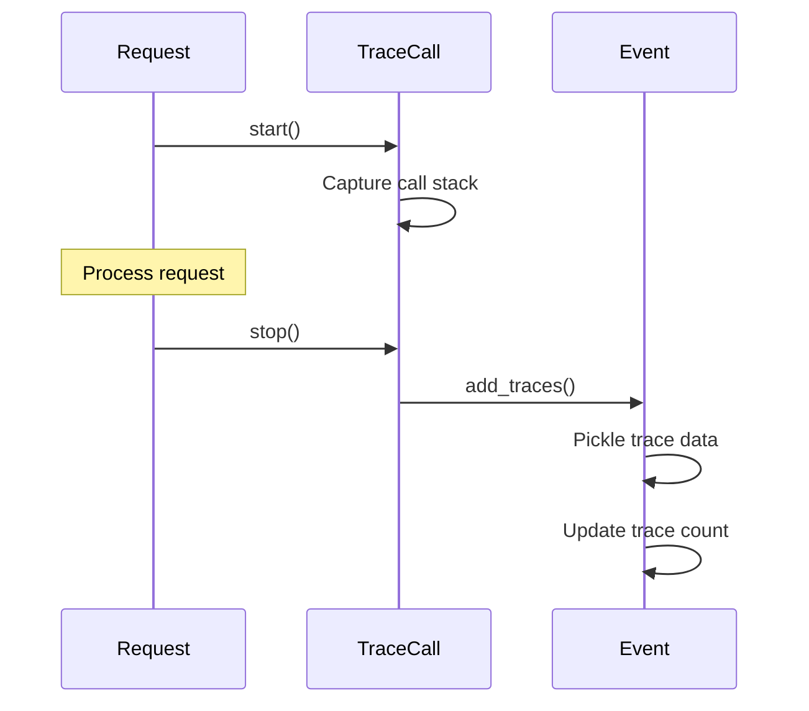

# HTTP Events System

## 📋 Overview

**Module**: `osbot_fast_api.api.Fast_API__Http_Events`  
**Purpose**: Comprehensive HTTP request/response tracking and monitoring  
**Status**: Production Ready

## 🏗️ Architecture



## 🔄 Event Lifecycle



## 📊 Event Data Structure

### Fast_API__Http_Event

The main event container that aggregates all event data:

```python
class Fast_API__Http_Event(Type_Safe):
    http_event_info     : Fast_API__Http_Event__Info
    http_event_request  : Fast_API__Http_Event__Request
    http_event_response : Fast_API__Http_Event__Response
    http_event_traces   : Fast_API__Http_Event__Traces
    event_id            : Random_Guid
```

### Event Components

#### Http_Event__Info

```python
class Fast_API__Http_Event__Info(Type_Safe):
    fast_api_name  : str           # API instance name
    log_messages   : list          # Event log messages
    client_city    : str           # CloudFront header
    client_country : str           # CloudFront header
    client_ip      : str           # Client IP address
    event_id       : Random_Guid   # Unique event ID
    info_id        : Random_Guid   # Info component ID
    domain         : str           # Request domain
    timestamp      : int           # UTC timestamp
    thread_id      : int           # Thread identifier
```

#### Http_Event__Request

```python
class Fast_API__Http_Event__Request(Type_Safe):
    duration   : Decimal       # Request duration in seconds
    event_id   : Random_Guid   # Parent event ID
    host_name  : str           # Request hostname
    headers    : dict          # Request headers
    method     : str           # HTTP method
    port       : int           # Server port
    request_id : Random_Guid   # Request component ID
    start_time : Decimal       # Start timestamp
    path       : str           # Request path
```

#### Http_Event__Response

```python
class Fast_API__Http_Event__Response(Type_Safe):
    content_length : str           # Response size
    content_type   : str           # MIME type
    end_time       : Decimal       # End timestamp
    event_id       : Random_Guid   # Parent event ID
    response_id    : Random_Guid   # Response component ID
    status_code    : int           # HTTP status
    headers        : dict          # Response headers
```

#### Http_Event__Traces

```python
class Fast_API__Http_Event__Traces(Type_Safe):
    event_id     : Random_Guid   # Parent event ID
    traces_id    : Random_Guid   # Traces component ID
    traces       : list          # Pickled trace data
    traces_count : int           # Number of traces
```

## 🔧 Event Manager

### Fast_API__Http_Events Class



### Storage Mechanism

```python
# Circular buffer implementation
requests_order = deque(maxlen=None)  # Manual size management
requests_data = {}                   # Event storage

# Storage algorithm
if len(requests_order) > max_requests_logged:
    request_id_to_remove = requests_order.popleft()
    del requests_data[request_id_to_remove]
```

## 🛡️ Data Sanitization

### Automatic Cleaning

The system automatically sanitizes sensitive data:



### Cleaned Fields

| Field | Cleaning Method | Example Output |
|-------|----------------|----------------|
| `cookie` header | MD5 hash + size | `data cleaned: (size: 245, hash: abc123...)` |
| `authorization` header | MD5 hash + size | `data cleaned: (size: 64, hash: def456...)` |
| Request body | Not stored | N/A |
| Response body | Not stored | N/A |

## 📈 Event Tracking Features

### Request Correlation

```python
# Correlation ID added to headers
HEADER_NAME__FAST_API_REQUEST_ID = 'fast-api-request-id'

# Available in request.state
request.state.request_id = event_id
request.state.request_data = http_event
```

### Duration Tracking

```python
# Precise timing with Decimal
start_time = Decimal(time.time())
end_time = Decimal(time.time())
duration = (end_time - start_time).quantize(Decimal('0.001'))
```

### Thread Tracking

```python
# Thread identification for debugging
thread_id = current_thread_id()
```

## 🔍 Trace Integration

### Trace Call Configuration

```python
trace_call_config = Trace_Call__Config(
    ignore_start_with=['osbot_fast_api.api.Fast_API__Http_Events']
)
```

### Trace Capture



## 📊 Monitoring Capabilities

### Built-in Metrics

| Metric | Type | Description |
|--------|------|-------------|
| Request Duration | Decimal | Time to process request |
| Request Count | Integer | Total requests handled |
| Error Rate | Calculated | Failed requests / Total |
| Client Distribution | Geographic | City/Country from CloudFront |
| Thread Usage | Integer | Active thread IDs |

### Log Messages

```python
def add_log_message(self, message_text, level=logging.INFO):
    timestamp_delta = timestamp_utc_now() - self.http_event_info.timestamp
    message = {
        'level': level,
        'text': message_text,
        'timestamp': timestamp_delta
    }
    self.http_event_info.log_messages.append(message)
```

## 🔄 Background Tasks

Support for async background tasks:

```python
# Register background tasks
http_events.background_tasks.append(background_function)

# Executed after response
for task in http_events.background_tasks:
    background_tasks.add_task(task, request=request, response=response)
```

## 🎯 Usage Examples

### Basic Event Tracking

```python
fast_api = Fast_API()
fast_api.http_events.max_requests_logged = 100  # Increase buffer
fast_api.http_events.clean_data = True          # Enable sanitization
```

### Custom Callbacks

```python
def on_request(event: Fast_API__Http_Event):
    print(f"Request: {event.http_event_request.path}")

def on_response(response, event: Fast_API__Http_Event):
    print(f"Response: {event.http_event_response.status_code}")

fast_api.http_events.callback_on_request = on_request
fast_api.http_events.callback_on_response = on_response
```

### Enable Tracing

```python
fast_api.http_events.trace_calls = True
fast_api.http_events.trace_call_config.max_depth = 10
```

### Access Event Data

```python
# In route handler
@app.get("/status")
def status(request: Request):
    event_id = request.state.request_id
    event_data = request.state.request_data
    return {"event_id": str(event_id)}
```

## ⚡ Performance Considerations

### Memory Management

- Fixed buffer size (default 50 events)
- Automatic cleanup of old events
- Pickled traces for efficiency
- Lazy data cleaning

### Overhead

| Operation | Time | Impact |
|-----------|------|--------|
| Event creation | ~1ms | Minimal |
| Data sanitization | ~0.5ms | Minimal |
| Trace capture | ~5ms | Optional |
| Storage | O(1) | Constant |

## 🔐 Security Features

1. **Automatic sanitization** of sensitive headers
2. **No request/response body storage** by default
3. **Correlation IDs** for audit trails
4. **Thread isolation** for concurrent requests

## 🎯 Best Practices

1. **Adjust buffer size** based on traffic volume
2. **Enable sanitization** in production
3. **Use callbacks** for custom monitoring
4. **Disable tracing** in production for performance
5. **Monitor memory usage** with large buffers