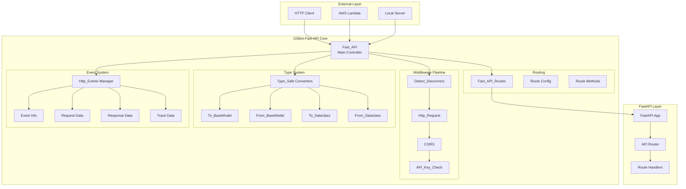
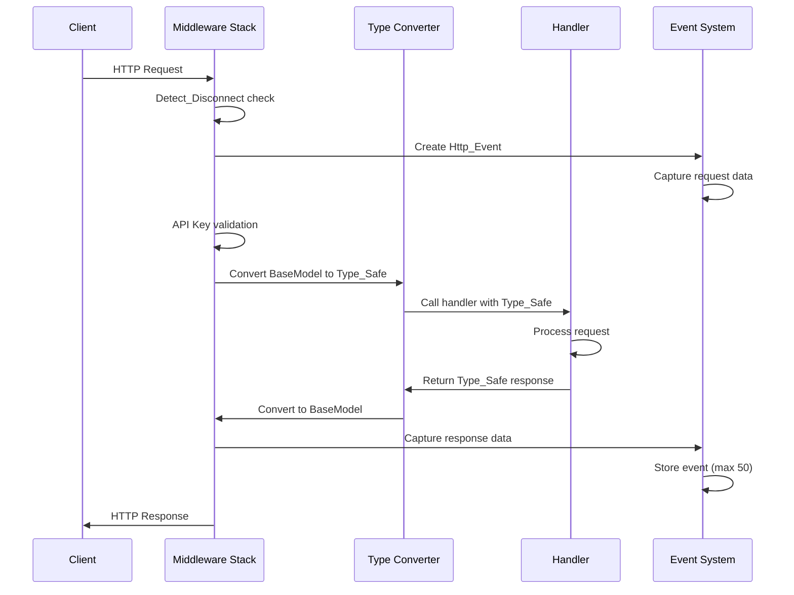
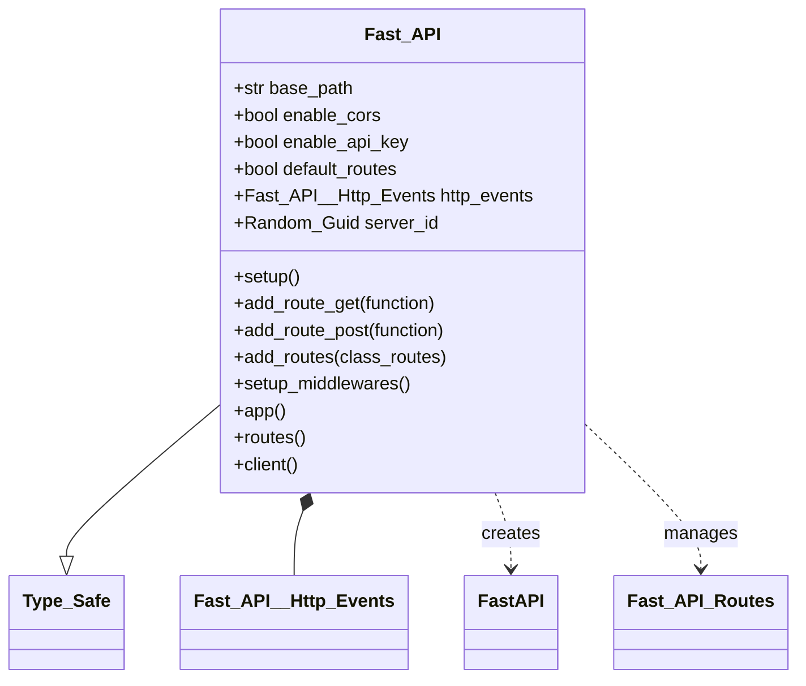
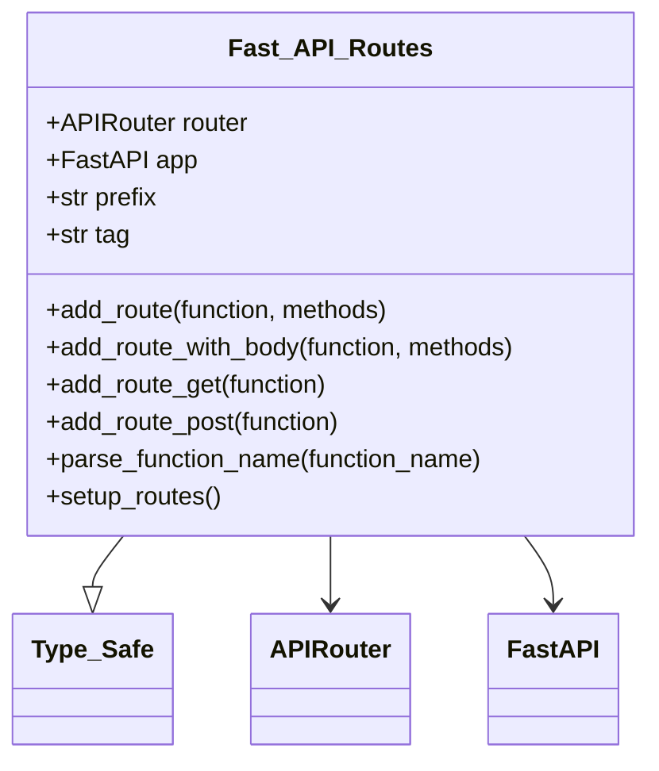
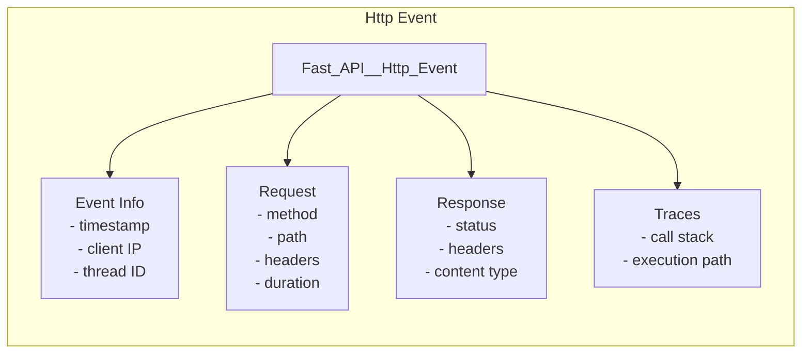
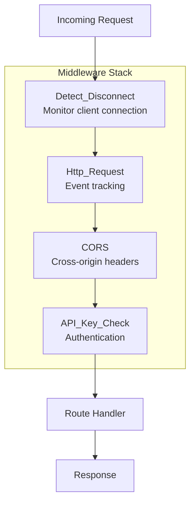
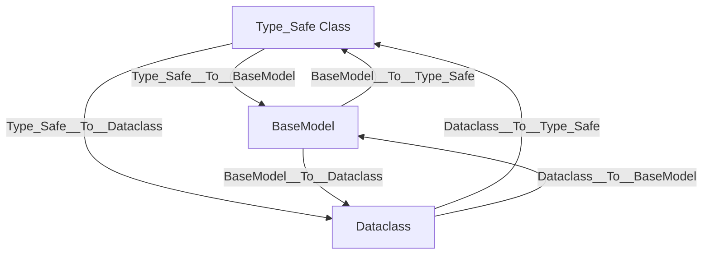
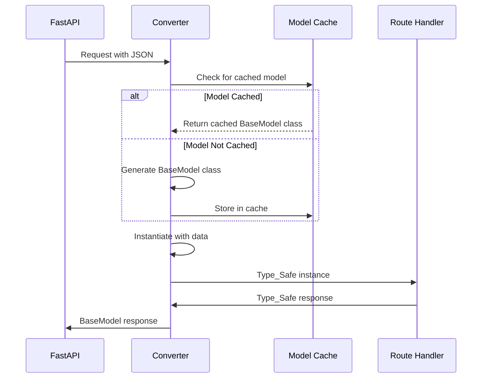
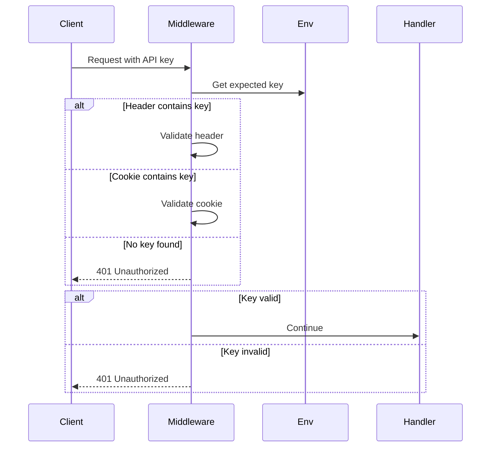

# OSBot-Fast-API Architecture

## 📋 Overview

**Module**: `osbot_fast_api`  
**Purpose**: Type-Safe FastAPI wrapper with enhanced middleware and monitoring capabilities  
**Status**: Production Ready

## 🏗️ System Architecture



## 🔄 Request Lifecycle



## 🧩 Core Components

### Fast_API Class

The main controller that orchestrates all components:



**Responsibilities**:
- FastAPI application lifecycle
- Middleware chain configuration
- Route registration and management
- HTTP event coordination
- Global exception handling

### Fast_API_Routes Class

Base class for organizing routes with automatic Type-Safe conversion:



**Route Path Generation Algorithm**:
```python
# Function name to path conversion
an_post()           → /an-post
get_user()          → /get-user
users__id()         → /users/{id}
users__id_profile() → /users/{id}/profile
```

### HTTP Events System

Comprehensive request/response tracking:



**Event Storage**:
- Circular buffer (deque) with max 50 events
- FIFO eviction policy
- Automatic sensitive data cleaning

## 🔐 Middleware Architecture

### Middleware Pipeline



### Middleware Responsibilities

| Middleware | Purpose | Configuration |
|------------|---------|---------------|
| `Detect_Disconnect` | Monitor client disconnections | Always enabled |
| `Http_Request` | Track HTTP events | Always enabled |
| `CORS` | Handle cross-origin requests | `enable_cors=True` |
| `API_Key_Check` | Validate API keys | `enable_api_key=True` |

## 🔄 Type Conversion System

### Conversion Matrix



### Conversion Process



## 📊 Performance Characteristics

### Operation Complexity

| Operation | Time | Space | Notes |
|-----------|------|-------|-------|
| Route registration | O(1) | O(1) | Direct dictionary insertion |
| Type conversion (cached) | O(1) | O(1) | Cache lookup |
| Type conversion (new) | O(n) | O(n) | n = number of fields |
| Event tracking | O(1) | O(1) | Deque operations |
| Middleware chain | O(m) | O(1) | m = number of middleware |

### Memory Management

- **Model Cache**: Singleton pattern, shared across instances
- **Event Buffer**: Maximum 50 events, ~10KB per event
- **Route Registry**: Lazy loading, minimal overhead

## 🛡️ Security Architecture

### API Key Validation



### Data Sanitization

- Automatic cookie removal from logged headers
- Auth header masking in events
- Stack trace prevention in production

## 🔧 Extension Points

### Custom Middleware

```python
class Custom_Fast_API(Fast_API):
    def setup_middlewares(self):
        super().setup_middlewares()
        # Add custom middleware here
        self.app().add_middleware(CustomMiddleware)
```

### Custom Routes

```python
class Custom_Routes(Fast_API_Routes):
    def setup_routes(self):
        # Add routes with Type-Safe support
        self.add_route_get(self.custom_method)
```

### Event Callbacks

```python
fast_api.http_events.callback_on_request = handle_request
fast_api.http_events.callback_on_response = handle_response
```

## 🚀 Deployment Patterns

### Local Development

```
Fast_API → Uvicorn → Local Server
```

### AWS Lambda

```
Fast_API → Mangum → Lambda Handler → API Gateway
```

### Docker Container

```
Fast_API → Uvicorn → Docker → Container Service
```

## 📈 Scalability Considerations

- **Stateless Design**: No shared state between requests
- **Cache Efficiency**: Model caching reduces CPU overhead
- **Event Buffer**: Fixed memory footprint
- **Middleware Performance**: O(1) operations per middleware

## 🔍 Monitoring & Observability

Built-in monitoring through:
- Request correlation IDs
- Execution traces
- Duration measurements
- Thread tracking
- Event history