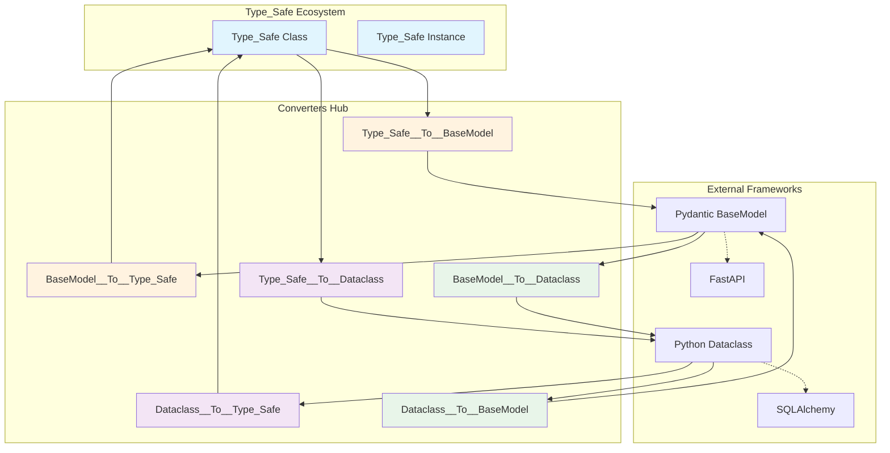
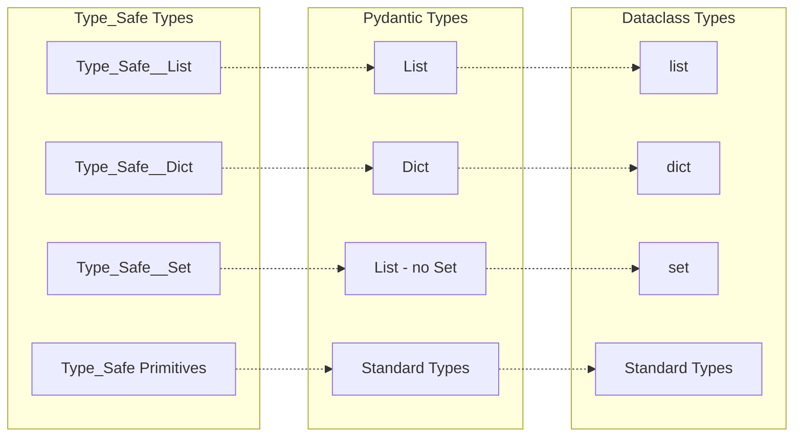
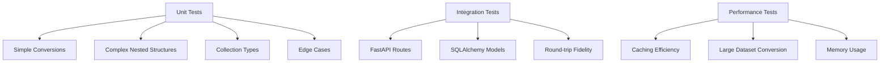

# Type_Safe Converters Architecture

## 🎯 Overview

The Type_Safe converters provide bidirectional transformation between Type_Safe classes and standard Python model frameworks (Pydantic BaseModel and dataclasses). This enables Type_Safe to integrate seamlessly with popular frameworks like FastAPI while maintaining its strong type safety guarantees.

**Status**: Production Ready  
**Version**: 1.0.0  
**Compatibility**: Python 3.8+, Pydantic v2+, FastAPI 0.100+

## 🏗️ Architecture Overview



## 🔄 Conversion Matrix

| From → To | Type_Safe | BaseModel | Dataclass |
|-----------|-----------|-----------|-----------|
| **Type_Safe** | - | `Type_Safe__To__BaseModel` | `Type_Safe__To__Dataclass` |
| **BaseModel** | `BaseModel__To__Type_Safe` | - | `BaseModel__To__Dataclass` |
| **Dataclass** | `Dataclass__To__Type_Safe` | `Dataclass__To__BaseModel` | - |

## 🎭 Design Principles

### 1. **Type_Safe as Source of Truth**
Type_Safe remains the canonical representation. Conversions are views/projections, not replacements.

### 2. **Lazy Conversion**
Only convert what's needed when it's needed for performance optimization.

### 3. **Type Information Preservation**
Maintain type hints, validators, and metadata through conversion cycles.

### 4. **Minimal Surface Area**
Only implement the subset of BaseModel/dataclass features needed for compatibility.

### 5. **Bidirectional Fidelity**
Round-trip conversions should maintain data integrity: `Type_Safe → BaseModel → Type_Safe` should preserve information.

## 🔧 Core Components

### Converter Base Pattern

Each converter follows this structure:

```python
class Type_Safe__To__X(Type_Safe):
    model_cache: Dict[Type, Type[X]]  # Cache for generated models
    
    @type_safe
    def convert_class(self, source_class: Type[Source]) -> Type[Target]:
        # Convert class definition
        pass
    
    @type_safe
    def convert_instance(self, source_instance: Source) -> Target:
        # Convert instance with data
        pass
```

### Type Mapping Registry



## 🚀 Usage Patterns

### FastAPI Integration

```python
# Define in Type_Safe
class UserRequest(Type_Safe):
    username: str
    email: str
    age: int

# Convert for FastAPI
UserRequestModel = type_safe__to__basemodel.convert_class(UserRequest)

@app.post("/users")
async def create_user(user: UserRequestModel):
    # Convert back to Type_Safe for business logic
    type_safe_user = basemodel__to__type_safe.convert_instance(user)
    # Process with Type_Safe guarantees
    result = process_user(type_safe_user)
    # Convert back for response
    return type_safe__to__basemodel.convert_instance(result)
```

### Dataclass Integration

```python
# For ORM compatibility
@dataclass
class UserORM:
    id: int
    username: str
    created_at: datetime

# Convert from Type_Safe for database
user_orm = type_safe__to__dataclass.convert_instance(type_safe_user)
db.session.add(user_orm)

# Convert back after retrieval
type_safe_user = dataclass__to__type_safe.convert_instance(user_orm)
```

## 🎯 Converter Responsibilities

### Type_Safe → BaseModel
- Dynamic BaseModel class generation
- Type annotation mapping
- Default value preservation
- Nested Type_Safe handling
- Collection type conversion
- Validator migration

### BaseModel → Type_Safe
- Field extraction via `.dict()`
- Type reconstruction
- Collection wrapping (Type_Safe__List, etc.)
- Validation error mapping
- Custom validator preservation

### Type_Safe → Dataclass
- `@dataclass` class generation
- Field definition with defaults
- Type hint mapping
- `field()` metadata for constraints
- Post-init validation hooks

### Dataclass → Type_Safe
- Field introspection via `fields()`
- Type mapping reconstruction
- Default factory handling
- Metadata extraction
- Type_Safe validation application

### BaseModel ↔ Dataclass
- Leverage Pydantic's existing capabilities
- Use `model_validate()` for dataclass → BaseModel
- Use `asdict()` for BaseModel → dataclass
- Maintain type safety throughout

## 🔐 Security Considerations

1. **Type Validation**: All conversions maintain strict type checking
2. **Injection Prevention**: No dynamic code execution during conversion
3. **Memory Safety**: Cached models use WeakKeyDictionary where appropriate
4. **Data Sanitization**: Input validation at conversion boundaries

## ⚡ Performance Characteristics

| Operation | Time Complexity | Space Complexity | Cached |
|-----------|----------------|------------------|---------|
| Class Conversion | O(n) fields | O(1) | ✅ |
| Instance Conversion | O(n) fields | O(n) data | ❌ |
| Nested Conversion | O(n*m) depth | O(n*m) | Partial |
| Collection Conversion | O(n) items | O(n) | ❌ |

## 🧪 Testing Strategy



## 📊 Metrics & Monitoring

Key metrics to track:
- Conversion success rate
- Cache hit ratio
- Average conversion time
- Memory usage per model
- Type mismatch frequency

## 🚦 Error Handling

```python
try:
    converted = converter.convert_instance(source)
except TypeError as e:
    # Type mismatch during conversion
    log.error(f"Type conversion failed: {e}")
except ValueError as e:
    # Validation error
    log.error(f"Validation failed: {e}")
except AttributeError as e:
    # Missing required field
    log.error(f"Field missing: {e}")
```
