# Why Async routes are NOT used in OSBot-Fast-API

## 📋 Overview

**Design Decision**: OSBot-Fast-API intentionally uses synchronous route handlers  
**Reason**: Preventing server-wide hangs caused by async/sync mixing  
**Status**: Deliberate architectural choice for production stability

## 🔴 The Critical Issue with Async in FastAPI

### The Problem

FastAPI's async implementation has a critical vulnerability: **mixing async and sync operations can cause the entire server to hang**, making it unable to process any new requests. This isn't a theoretical issue - it's a real production problem that has affected numerous deployments.

```python
# ❌ DANGEROUS: This can hang your entire server
@app.get("/dangerous")
async def dangerous_endpoint():
    # Async function calling sync blocking operation
    result = requests.get("https://slow-api.com")  # Sync blocking call
    return {"data": result.json()}
    
# Once this endpoint is hit, your entire server can become unresponsive
```

### Why This Happens

```mermaid
graph TD
    A[FastAPI with Async Routes] --> B[Single Event Loop]
    B --> C[Async Route Called]
    C --> D{Contains Sync Blocking Call?}
    D -->|Yes| E[Event Loop Blocked]
    D -->|No| F[Normal Async Processing]
    E --> G[⚠️ ALL Requests Blocked]
    E --> H[Server Appears Frozen]
    E --> I[No New Connections Accepted]
    
    style E fill:#ff6b6b
    style G fill:#ff6b6b
    style H fill:#ff6b6b
    style I fill:#ff6b6b
```



When you use async routes in FastAPI:
1. FastAPI runs on an **event loop** (usually uvloop)
2. The event loop is **single-threaded** for async operations
3. If an async function makes a **blocking synchronous call**, it blocks the entire event loop
4. **Result**: No other requests can be processed until the blocking call completes

## 🎯 Real-World Scenarios Where This Occurs

### Common Triggers

```python
# ❌ Database call with sync library
@app.get("/users")
async def get_users():
    users = db.query("SELECT * FROM users")  # Sync DB call
    return users

# ❌ File I/O without async
@app.post("/upload")
async def upload_file(file: UploadFile):
    with open(f"uploads/{file.filename}", "wb") as f:  # Sync file operation
        f.write(file.file.read())
    return {"status": "uploaded"}

# ❌ External API call with requests
@app.get("/weather")
async def get_weather():
    response = requests.get("http://api.weather.com/data")  # Sync HTTP call
    return response.json()

# ❌ CPU-intensive operation
@app.post("/process")
async def process_data(data: dict):
    result = heavy_computation(data)  # Sync CPU-bound operation
    return {"result": result}
```

### The Insidious Nature

What makes this particularly dangerous:
- **Works fine in development** with low traffic
- **Passes basic tests** because single requests work
- **Fails catastrophically in production** under load
- **Hard to debug** - server just stops responding
- **No clear error messages** - appears as timeouts

## 🛡️ OSBot-Fast-API's Solution: Sync-First Architecture

### Design Philosophy

```python
# ✅ SAFE: OSBot-Fast-API approach
class Routes_API(Fast_API_Routes):
    def get_users(self):  # Sync function
        # Safe to use any sync library
        users = db.query("SELECT * FROM users")
        response = requests.get("http://api.example.com")
        with open("file.txt") as f:
            data = f.read()
        return {"users": users, "data": data}
```

### How Sync Routes Work in FastAPI


When you use sync routes:
1. FastAPI automatically runs them in a **thread pool**
2. Each request gets its **own thread**
3. Blocking operations only block **that thread**
4. Other requests continue processing normally
5. **Result**: One slow request doesn't affect others

## 📊 Performance Comparison

### Async Routes (Dangerous)

```python
# Server with async routes mixing sync operations
@app.get("/async-mixed")
async def mixed_async():
    await asyncio.sleep(0.1)  # Async - OK
    time.sleep(0.1)  # Sync - BLOCKS EVENT LOOP!
    return {"status": "done"}
```

**Under Load**:
- 10 concurrent requests
- First request blocks event loop for 100ms
- **Result**: All 10 requests take 1+ second total
- **Server appears frozen** during blocking calls

### Sync Routes (Safe)

```python
# Server with sync routes (OSBot-Fast-API approach)
@app.get("/sync-safe")
def safe_sync():
    time.sleep(0.1)  # Runs in thread pool
    return {"status": "done"}
```

**Under Load**:
- 10 concurrent requests
- Each runs in separate thread
- **Result**: All complete in ~100ms (parallel)
- **Server remains responsive**

## 🔍 Evidence from the Community

Common issues reported with async/sync mixing:

1. **"FastAPI server hangs when using requests library in async endpoint"**
2. **"Entire API becomes unresponsive after calling boto3 in async route"**
3. **"Production server freezes intermittently, works fine in development"**
4. **"SQLAlchemy sync queries causing FastAPI to stop responding"**

These aren't edge cases - they're common pitfalls that have caused production outages.

## ✅ Benefits of Sync-First Approach

### 1. **Reliability**
- No risk of event loop blocking
- Predictable behavior under load
- Server remains responsive

### 2. **Simplicity**
- Use any Python library without worry
- No need to check if libraries are async-compatible
- Easier debugging and profiling

### 3. **Compatibility**
- Works with all existing Python libraries
- No need for async versions of everything
- Can use battle-tested sync libraries

### 4. **Developer Safety**
- Junior developers can't accidentally hang the server
- No need to understand event loop internals
- Reduced cognitive load

## 🎯 When Async Makes Sense

We're not saying async is always bad. It's excellent for:

1. **Pure async operations** with no sync calls
2. **WebSocket connections**
3. **Server-Sent Events (SSE)**
4. **When you have complete control** over all code paths

But in a production API where:
- Multiple developers contribute
- Various libraries are used
- Reliability is paramount
- You can't guarantee pure async

**Sync routes are the safer, more reliable choice.**

## 💡 Best Practices for OSBot-Fast-API

### Do's ✅

```python
class Routes_Safe(Fast_API_Routes):
    def process_data(self, data: dict):
        # Safe to use any sync operation
        result = sync_database.query(data)
        external_api = requests.post("http://api.com", json=data)
        with open("output.txt", "w") as f:
            f.write(str(result))
        return {"status": "processed"}
```

### Don'ts ❌

```python
# Don't try to force async in OSBot-Fast-API
class Routes_Unsafe(Fast_API_Routes):
    async def process_data(self, data: dict):  # Avoid this
        # Mixing async/sync is dangerous
        pass
```

## 📈 Production Evidence

After switching from async to sync routes in OSBot-Fast-API:

- **Zero server hangs** in production
- **Consistent response times** under load
- **Easier debugging** of performance issues
- **No complaints** about performance degradation
- **Simpler code** without async/await complexity

## 🔬 Thread Pool Performance

FastAPI's thread pool (via Starlette) is highly optimized:
- Default 40 threads (configurable)
- Efficient thread reuse
- Minimal overhead for sync routes
- Scales well to thousands of requests/second

```python
# Configure thread pool size if needed
import anyio
anyio.to_thread.current_default_thread_limiter().total_tokens = 100
```

## 🎬 Conclusion

**The decision to avoid async in OSBot-Fast-API routes is a deliberate architectural choice based on real production failures.** 

While async has its place, the risk of server-wide hangs from mixed async/sync operations is too high for production APIs. By using sync routes with FastAPI's thread pool, we get:

- **100% reliability** - No event loop blocking
- **Full compatibility** - Use any Python library
- **Simplicity** - No async complexity
- **Safety** - Can't accidentally hang the server

This isn't about being anti-async; it's about choosing **reliability and simplicity over marginal performance gains** that come with significant risks.

> **"The best optimization is the one that keeps your server running."**

---

*This design decision was made after experiencing multiple production incidents where async routes with inadvertent sync calls caused complete server failures. The sync-first approach has proven to be more reliable, maintainable, and surprisingly performant in real-world applications.*