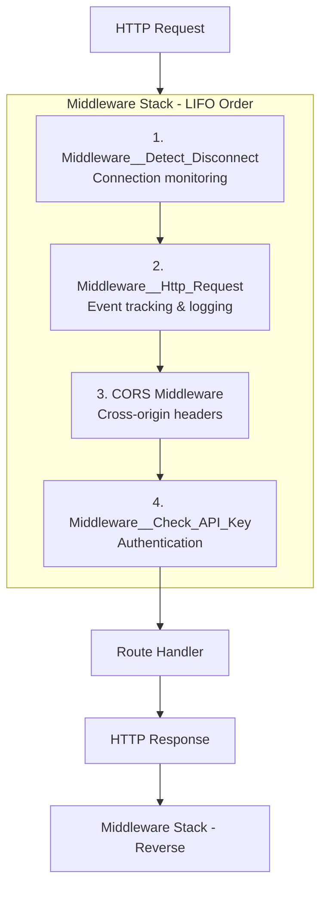
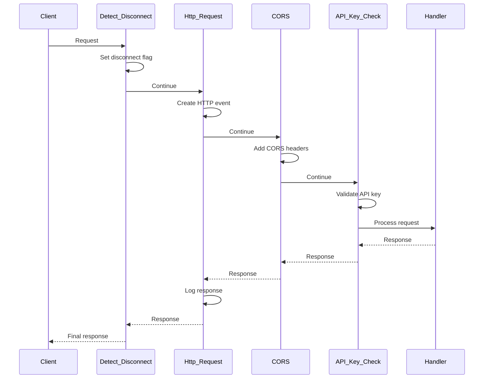
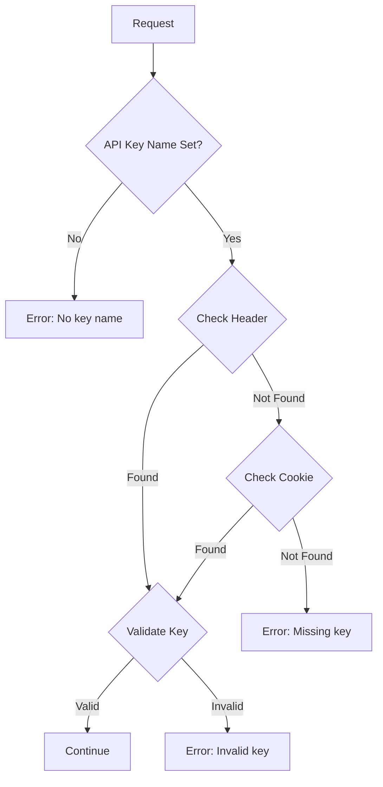

# Middleware Stack

## 📋 Overview

**Module**: `osbot_fast_api.api.middlewares`  
**Purpose**: Composable middleware pipeline for request processing  
**Status**: Production Ready

## 🏗️ Middleware Architecture



## 🔄 Middleware Execution Order

### Registration Order (LIFO)

```python
# Middleware are added in this order
app.add_middleware(Middleware__Detect_Disconnect)    # Executes first
app.add_middleware(Middleware__Http_Request)         # Executes second
app.add_middleware(CORSMiddleware)                   # Executes third
app.add_middleware(Middleware__Check_API_Key)        # Executes fourth
```

### Execution Flow



## 🛡️ Built-in Middleware

### 1. Middleware__Detect_Disconnect

Monitors client disconnections to prevent processing abandoned requests:

```python
class Middleware__Detect_Disconnect:
    async def __call__(self, scope, receive, send):
        async def disconnect_monitor_receive():
            message = await receive()
            if message["type"] == "http.disconnect":
                scope.get('state')['is_disconnected'] = True
            return message
        
        scope.get('state')['is_disconnected'] = False
        await self.app(scope, disconnect_monitor_receive, send)
```

**Features**:
- Sets `is_disconnected` flag in request scope
- Prevents unnecessary processing for disconnected clients
- Useful for streaming responses

### 2. Middleware__Http_Request

Core middleware for HTTP event tracking:

```python
class Middleware__Http_Request(BaseHTTPMiddleware):
    def __init__(self, app, http_events: Fast_API__Http_Events):
        self.http_events = http_events
    
    async def dispatch(self, request, call_next):
        self.http_events.on_http_request(request)
        response = None
        try:
            response = await call_next(request)
        finally:
            self.http_events.on_http_response(request, response)
        return response
```

**Features**:
- Creates HTTP events for every request
- Tracks request/response lifecycle
- Adds background tasks to response
- Exception-safe logging

### 3. CORS Middleware

Handles Cross-Origin Resource Sharing:

```python
app.add_middleware(
    CORSMiddleware,
    allow_origins=["*"],
    allow_credentials=True,
    allow_methods=["GET", "POST", "HEAD"],
    allow_headers=["Content-Type", "X-Requested-With", 
                   "Origin", "Accept", "Authorization"],
    expose_headers=["Content-Type", "X-Requested-With", 
                    "Origin", "Accept", "Authorization"]
)
```

**Configuration**:

| Setting | Default | Description |
|---------|---------|-------------|
| `allow_origins` | `["*"]` | Allowed origins |
| `allow_credentials` | `True` | Include credentials |
| `allow_methods` | `["GET", "POST", "HEAD"]` | HTTP methods |
| `allow_headers` | Various | Allowed request headers |
| `expose_headers` | Various | Exposed response headers |

### 4. Middleware__Check_API_Key

API key validation middleware:



**Implementation**:

```python
class Middleware__Check_API_Key(BaseHTTPMiddleware):
    def __init__(self, app, env_var__api_key__name, env_var__api_key__value):
        self.api_key__name = get_env(env_var__api_key__name)
        self.api_key__value = get_env(env_var__api_key__value)
    
    async def dispatch(self, request, call_next):
        # Check header first
        api_key = request.headers.get(self.api_key__name)
        
        # Fallback to cookie
        if not api_key:
            api_key = request.cookies.get(self.api_key__name)
        
        # Validate
        if api_key != self.api_key__value:
            return Response(
                content=json.dumps({"error": "Invalid API key"}),
                status_code=401,
                media_type="application/json"
            )
        
        return await call_next(request)
```

**Error Messages**:
- `ERROR_MESSAGE__NO_KEY_NAME_SETUP`: Server missing key name
- `ERROR_MESSAGE__NO_KEY_VALUE_SETUP`: Server missing key value
- `ERROR_MESSAGE__API_KEY_MISSING`: Client missing key
- `ERROR_MESSAGE__API_KEY_INVALID`: Invalid key value

## 🔧 Middleware Configuration

### Enabling Middleware

```python
fast_api = Fast_API(
    enable_cors=True,      # Enable CORS middleware
    enable_api_key=True    # Enable API key validation
)
```

### Environment Variables

```bash
# API Key Configuration
export FAST_API__AUTH__API_KEY__NAME="X-API-Key"
export FAST_API__AUTH__API_KEY__VALUE="your-secret-key"
```

### Custom Middleware Setup

```python
class Custom_Fast_API(Fast_API):
    def setup_middlewares(self):
        # Call parent to add default middleware
        super().setup_middlewares()
        
        # Add custom middleware
        @self.app().middleware("http")
        async def custom_middleware(request: Request, call_next):
            # Pre-processing
            request.state.custom_data = "value"
            
            # Process request
            response = await call_next(request)
            
            # Post-processing
            response.headers["X-Custom-Header"] = "value"
            
            return response
```

## 📊 Middleware State Management

### Request State

Each middleware can add data to `request.state`:

```python
# Set by Detect_Disconnect
request.state.is_disconnected: bool

# Set by Http_Request
request.state.http_events: Fast_API__Http_Events
request.state.request_id: Random_Guid
request.state.request_data: Fast_API__Http_Event

# Set by custom middleware
request.state.user_message: str  # Example from tests
```

### Response Headers

Middleware can add response headers:

```python
# Added by Http_Request
response.headers['fast-api-request-id'] = event_id

# Added by CORS
response.headers['Access-Control-Allow-Origin'] = '*'

# Static file caching
response.headers['cache-control'] = 'public, max-age=3600'
```

## 🎯 Usage Examples

### Basic Middleware Configuration

```python
from osbot_fast_api.api.Fast_API import Fast_API

# Enable all middleware
fast_api = Fast_API(
    enable_cors=True,
    enable_api_key=True,
    default_routes=True
)
fast_api.setup()
```

### Custom Middleware Example

```python
from fastapi import Request
from osbot_fast_api.api.Fast_API import Fast_API

class Fast_API_With_Custom(Fast_API):
    def setup_middlewares(self):
        @self.app().middleware("http")
        async def timing_middleware(request: Request, call_next):
            import time
            start = time.time()
            response = await call_next(request)
            duration = time.time() - start
            response.headers["X-Process-Time"] = str(duration)
            return response
        
        # Add default middleware after custom
        super().setup_middlewares()
```

### Accessing Middleware Data in Routes

```python
from fastapi import Request

@app.get("/info")
def get_info(request: Request):
    return {
        "request_id": str(request.state.request_id),
        "is_disconnected": request.state.is_disconnected,
        "custom_data": getattr(request.state, 'custom_data', None)
    }
```

## ⚡ Performance Impact

### Middleware Overhead

| Middleware | Overhead | Impact |
|------------|----------|--------|
| Detect_Disconnect | ~0.1ms | Negligible |
| Http_Request | ~1-2ms | Minimal |
| CORS | ~0.2ms | Negligible |
| API_Key_Check | ~0.3ms | Negligible |

### Optimization Tips

1. **Order matters**: Place lightweight middleware first
2. **Conditional processing**: Skip expensive operations when possible
3. **Async operations**: Use async/await for I/O operations
4. **Caching**: Cache validation results where appropriate

## 🔐 Security Considerations

### API Key Security

- Keys stored in environment variables
- Never logged or exposed in responses
- Support for both header and cookie authentication
- Constant-time comparison to prevent timing attacks

### CORS Security

- Configure specific origins in production
- Avoid wildcard `*` for sensitive APIs
- Validate credentials carefully
- Limit exposed headers

## 🧪 Testing Middleware

### Unit Testing

```python
from osbot_fast_api.utils.Fast_API_Server import Fast_API_Server

def test_api_key_middleware():
    fast_api = Fast_API(enable_api_key=True)
    
    with Fast_API_Server(app=fast_api.app()) as server:
        # Without API key
        response = server.requests_get('/status')
        assert response.status_code == 401
        
        # With API key
        headers = {'X-API-Key': 'test-key'}
        response = server.requests_get('/status', headers=headers)
        assert response.status_code == 200
```

### Integration Testing

```python
def test_middleware_chain():
    fast_api = Fast_API(
        enable_cors=True,
        enable_api_key=True
    )
    
    with Fast_API_Server(app=fast_api.app()) as server:
        headers = {
            'X-API-Key': 'test-key',
            'Origin': 'http://example.com'
        }
        response = server.requests_get('/status', headers=headers)
        
        # Check CORS headers
        assert 'Access-Control-Allow-Origin' in response.headers
        
        # Check request ID
        assert 'fast-api-request-id' in response.headers
```

## 🎯 Best Practices

1. **Environment configuration**: Use environment variables for sensitive settings
2. **Error handling**: Implement proper error responses in middleware
3. **Logging**: Use HTTP events for audit trails
4. **Performance**: Profile middleware impact in production
5. **Security**: Validate all inputs and sanitize outputs
6. **Testing**: Test middleware in isolation and in combination