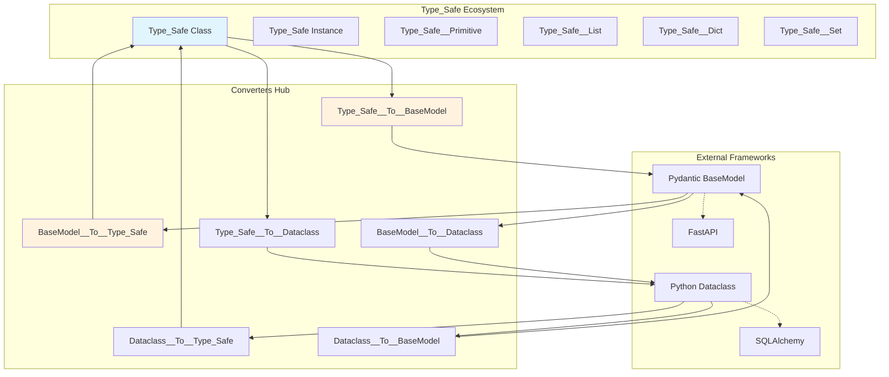
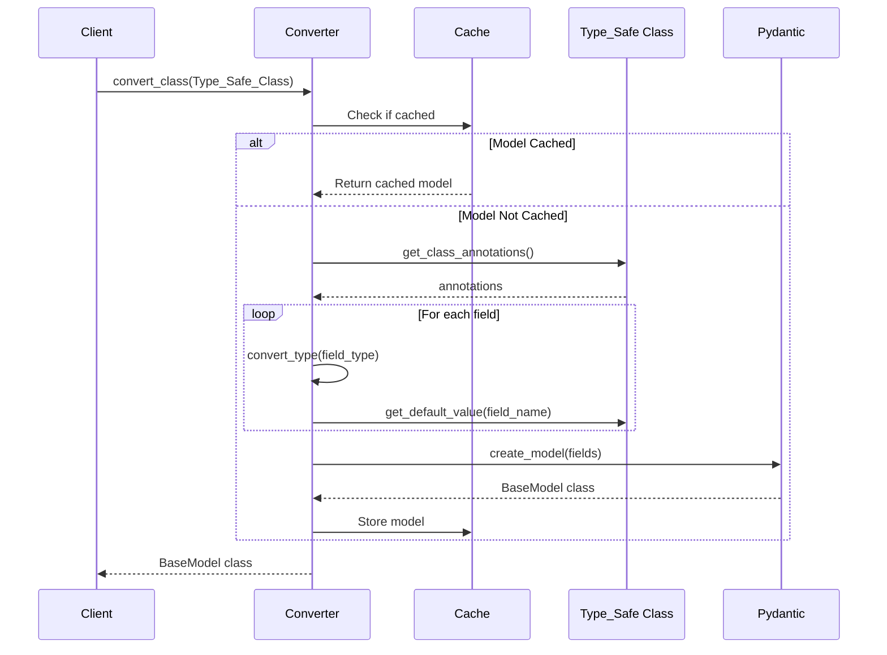
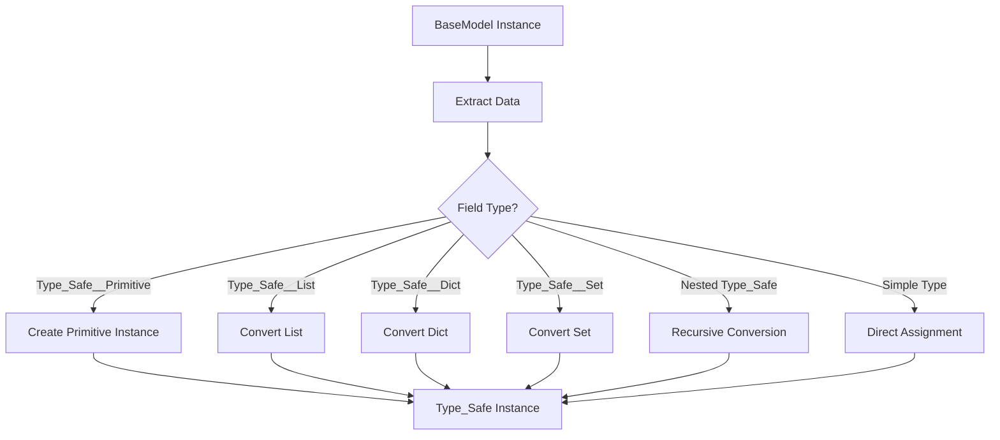

# Type-Safe Integration in OSBot-Fast-API

## 📋 Overview

**Module**: `osbot_fast_api.utils.type_safe`  
**Purpose**: Bidirectional conversion between Type_Safe classes and standard Python model frameworks  
**Status**: Production Ready  
**Compatibility**: Python 3.8+, Pydantic v2+, FastAPI 0.100+

## 🏗️ Architecture Overview



## 🔄 Conversion Matrix

| From → To | Type_Safe | BaseModel | Dataclass |
|-----------|-----------|-----------|-----------|
| **Type_Safe** | - | `Type_Safe__To__BaseModel` | `Type_Safe__To__Dataclass` |
| **BaseModel** | `BaseModel__To__Type_Safe` | - | `BaseModel__To__Dataclass` |
| **Dataclass** | `Dataclass__To__Type_Safe` | `Dataclass__To__BaseModel` | - |

## 🎭 Design Principles

1. **Type_Safe as Source of Truth**: Type_Safe remains the canonical representation
2. **Lazy Conversion**: Only convert what's needed when it's needed
3. **Type Information Preservation**: Maintain type hints, validators, and metadata
4. **Minimal Surface Area**: Only implement the subset of BaseModel/dataclass features needed
5. **Bidirectional Fidelity**: Round-trip conversions maintain data integrity

## 🔧 Core Components

### Type_Safe__To__BaseModel

Converts Type_Safe classes and instances to Pydantic BaseModels:



**Key Features**:
- Caches generated models for performance
- Preserves type annotations
- Maintains default values
- Handles nested Type_Safe classes
- Converts Type_Safe__Primitive to base types

### BaseModel__To__Type_Safe

Converts Pydantic BaseModels back to Type_Safe:



**Special Handling**:
- Type_Safe__Primitive fields are reconstructed
- Collections are properly wrapped
- Mutable defaults handled safely
- Nested structures recursively converted

## 📊 Type Mapping Table

### Basic Types

| Type_Safe Type | Pydantic Type | Dataclass Type | Notes |
|----------------|---------------|----------------|-------|
| `str` | `str` | `str` | Direct mapping |
| `int` | `int` | `int` | Direct mapping |
| `float` | `float` | `float` | Direct mapping |
| `bool` | `bool` | `bool` | Direct mapping |
| `None` | `None` | `None` | Explicit None handling |

### Collection Types

| Type_Safe Type | Pydantic Type | Dataclass Type | Notes |
|----------------|---------------|----------------|-------|
| `Type_Safe__List` | `List[T]` | `list` | Generic preserved |
| `Type_Safe__Dict` | `Dict[K, V]` | `dict` | Key/value types preserved |
| `Type_Safe__Set` | `List[T]` | `set` | Set → List for Pydantic |

### Special Types

| Type_Safe Type | Pydantic Type | Dataclass Type | Notes |
|----------------|---------------|----------------|-------|
| `Type_Safe__Primitive` | Base primitive | Standard type | Converts to underlying type |
| `Type_Safe` subclass | Nested BaseModel | Nested dataclass | Recursive conversion |
| `Optional[T]` | `Optional[T]` | `Optional[T]` | Null handling preserved |
| `Union[A, B]` | `Union[A, B]` | `Union[A, B]` | Multiple types supported |

## 🚀 Usage Patterns

### FastAPI Integration

```python
from osbot_utils.type_safe.Type_Safe import Type_Safe
from osbot_fast_api.utils.type_safe.Type_Safe__To__BaseModel import type_safe__to__basemodel

# Define Type_Safe class
class UserRequest(Type_Safe):
    username: str
    email: str
    age: int

# Convert for FastAPI
UserRequestModel = type_safe__to__basemodel.convert_class(UserRequest)

@app.post("/users")
async def create_user(user: UserRequestModel):
    # Convert back to Type_Safe for business logic
    type_safe_user = basemodel__to__type_safe.convert_instance(user)
    # Process with Type_Safe guarantees
    result = process_user(type_safe_user)
    # Convert back for response
    return type_safe__to__basemodel.convert_instance(result)
```

### Automatic Conversion in Routes

```python
from osbot_fast_api.api.Fast_API_Routes import Fast_API_Routes

class Routes_API(Fast_API_Routes):
    tag = 'api'
    
    def create_user(self, user: User):  # User is Type_Safe class
        # Automatic conversion happens here
        return {'created': user.username}
    
    def setup_routes(self):
        self.add_route_post(self.create_user)
```

## ⚡ Performance Characteristics

### Caching Strategy

```python
model_cache: Dict[Type, Type[BaseModel]]  # Class-level cache
```

**Benefits**:
- O(1) lookup for cached models
- Avoids repeated model generation
- Shared across converter instances via singleton

### Complexity Analysis

| Operation | Time Complexity | Space Complexity | Cached |
|-----------|-----------------|------------------|---------|
| `convert_class` (cached) | O(1) | O(1) | ✅ |
| `convert_class` (uncached) | O(n) fields | O(n) fields | ❌ |
| `convert_instance` | O(n) fields * O(d) depth | O(n * d) | ❌ |
| `convert_list` | O(m) items | O(m) | ❌ |
| `convert_dict` | O(k) keys | O(k) | ❌ |

## 🐛 Edge Cases & Error Handling

### Type_Safe__Primitive Handling

```python
class Safe_Email(Type_Safe__Primitive, str):
    def __new__(cls, value):
        if '@' not in value:
            raise ValueError("Invalid email")
        return super().__new__(cls, value)

# Conversion preserves validation
class User(Type_Safe):
    email: Safe_Email

# FastAPI receives validated email
user_model = type_safe__to__basemodel.convert_class(User)
```

### Circular References

```python
class Node(Type_Safe):
    value: str
    children: List['Node']  # Forward reference

# Handled via recursive conversion
NodeModel = converter.convert_class(Node)
```

### Mutable Defaults

```python
class Config(Type_Safe):
    tags: List[str] = []  # Mutable default

# Converter handles this safely
# Each instance gets its own list
```

## 🔒 Security Considerations

1. **No Code Execution**: Uses `create_model()`, not `exec()`
2. **Type Safety**: All conversions validated via `@type_safe`
3. **Memory Bounds**: Cache size implicitly limited by application scope
4. **Input Validation**: Pydantic validates on instantiation

## 🧪 Real-World Example: MGraph-AI Service

The MGraph-AI__Service__GitHub demonstrates advanced Type-Safe usage:

```python
# Strong typing for encryption
class Safe_Str__NaCl__Public_Key(Safe_Str):
    regex = re.compile(r'^[a-fA-F0-9]{64}$')
    exact_length = True
    max_length = 64

# Schema composition
class Schema__Encryption__Request(Type_Safe):
    value: Safe_Str__Decrypted_Value
    encryption_type: Enum__Encryption_Type

# Route with automatic conversion
class Routes__Encryption(Fast_API_Routes):
    def encrypt(self, request: Schema__Encryption__Request):
        # request is Type_Safe, validated and converted
        return self.service_encryption.encrypt(request)
```

## 🎯 Best Practices

1. **Use Singleton Converters**: Leverage `type_safe__to__basemodel` for cache sharing
2. **Convert at Boundaries**: Only at API entry/exit points
3. **Cache Warming**: Pre-convert frequently used models
4. **Type Hints**: Maintain accurate type annotations
5. **Validation**: Let Pydantic handle validation post-conversion

## 📈 Monitoring & Debugging

### Cache Metrics

```python
# Check cache size
cache_size = len(type_safe__to__basemodel.model_cache)

# Cache hit rate monitoring
hits = 0
misses = 0

def convert_with_metrics(cls):
    global hits, misses
    if cls in type_safe__to__basemodel.model_cache:
        hits += 1
    else:
        misses += 1
    return type_safe__to__basemodel.convert_class(cls)
```

### Conversion Validation

```python
# Verify round-trip conversion
original = User(name="Alice", email="alice@example.com")
basemodel = type_safe__to__basemodel.convert_instance(original)
recovered = basemodel__to__type_safe.convert_instance(basemodel)
assert original.json() == recovered.json()
```

## 🔍 Troubleshooting

### Common Issues

| Issue | Cause | Solution |
|-------|-------|----------|
| Missing fields after conversion | Field not in annotations | Ensure all fields have type hints |
| Type mismatch errors | Incompatible type mapping | Check type mapping table |
| Circular import errors | Forward references | Use string literals for forward refs |
| Performance degradation | Cache misses | Pre-warm cache with common models |